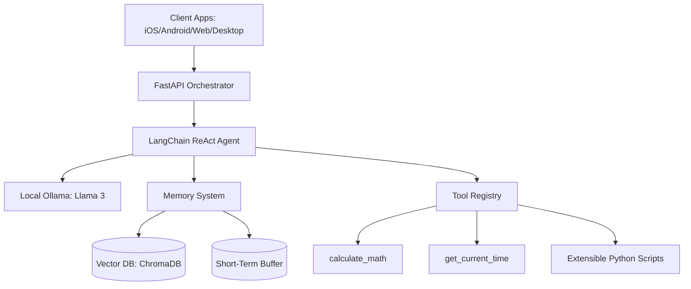

# Aria Ark-Reactor 🧠


**Aria Ark-Reactor** is an enterprise-grade, cross-platform AI Personal Assistant designed to be a seamless extension of your mind. Built from the ground up for absolute privacy and zero recurring costs, Aria runs entirely on your local hardware using offline LLMs (Llama 3) and local Vector Databases. 

No paid APIs. No cloud data harvesting. Just raw, localized intelligence.

---

## ✨ Core Features

*   **100% Offline & Free:** Powered by locally hosted `Ollama` models and local `ChromaDB` embeddings.
*   **Agentic Reasoning:** Utilizes a LangChain ReAct agent capable of thinking step-by-step and dynamically executing tools.
*   **Multi-Tiered Memory:**
    *   *Short-term Memory:* Context-aware conversation buffer.
    *   *Long-term Episodic Memory:* Mathematically embeds your facts and preferences into a local Vector DB for permanent recall.
*   **Cross-Platform Architecture:**
    *   🌍 Web (Next.js 14)
    *   📱 Mobile (React Native / Expo)
    *   💻 Desktop (Tauri / Vite)
*   **Enterprise-Grade Infrastructure:** Fully orchestrated via Docker Compose with CI/CD GitHub Actions built-in.

---

## 🏗️ Architecture Layout

Aria OS is structured as a scalable monorepo:

```text
/my-jarvis
├── apps/
│   ├── api/        # FastAPI Core Orchestrator (LangChain, ChromaDB)
│   ├── web/        # Next.js 14 Web Frontend (Tailwind, Framer Motion)
│   ├── mobile/     # React Native Expo Mobile App
│   └── desktop/    # Vite React App (prepared for Tauri)
├── packages/
│   └── core_ai/    # Shared AI Logic, Memory Management, and Agentic Tools
├── docker-compose.yml
└── .github/        # CI/CD Pipelines
```

### High-Level Data Flow



---

## ⚙️ How It Works (Core Functions)

Aria is fundamentally different from a standard stateless chatbot. She operates as a **ReAct (Reasoning + Acting) Agent**, meaning she actively "thinks" and uses tools to solve your requests securely and accurately.

### 1. The Cognitive Loop (LangChain Agent)
When you send a message, it is received by the FastAPI backend (`apps/api/main.py`). The core orchestrator initializes a LangChain Agent connected to a local Llama 3 model (via Ollama). 
Instead of blindly predicting the next word, Aria reads your prompt, formulates an internal **Thought**, decides if she needs a **Tool**, executes the **Action** locally, analyzes the **Observation**, and finally formulates a natural language **Response**.

### 2. Multi-Tiered Memory System (ChromaDB)
To feel like a true personal assistant, Aria utilizes two distinct types of memory:
- **Short-Term (Working Memory):** A standard conversational buffer that remembers the immediate back-and-forth context of your current chat session.
- **Long-Term (Episodic Vector Memory):** Powered by **ChromaDB**. If you tell Aria a permanent fact (e.g., *"My dog's name is Buster"* or *"I am allergic to peanuts"*), she triggers a hidden tool that converts this text into mathematical vectors using HuggingFace embeddings (`all-MiniLM-L6-v2`). These vectors are saved to a local, encrypted database. The next time you ask a related question, she performs a semantic similarity search across her database, retrieves the fact, injects it into her brain's context window, and answers correctly.

### 3. The Extensible Tool Registry
Aria's abilities are entirely modular. Located in `packages/core_ai/tools/registry.py`, her capabilities are defined as simple Python functions decorated with `@tool`. 
Currently, she has native access to:
- `get_current_time`: Bypasses AI hallucination by fetching the exact system time.
- `calculate_math`: Evaluates mathematical expressions deterministically.
- `save_memory`: Instructs the agent to store user preferences into the Vector Database.

Because of this Agentic registry, you can easily give Aria new "superpowers". Simply write a new Python function (e.g., `control_smart_lights` or `send_whatsapp_message`), add it to the registry array, and the LLM will automatically learn how and when to use it!

---

## 🚀 Getting Started (Run Locally)

Running the entire Aria OS stack takes just a few commands. The stack is containerized to automatically handle dependencies and pull necessary AI models.

### Prerequisites
*   [Docker](https://www.docker.com/) installed and running.
*   *Optional:* [Ollama](https://ollama.com) installed natively if you wish to run the LLM outside of Docker for better GPU performance.

### One-Command Deployment

Navigate to the root of the project and run:

```bash
docker-compose up --build
```

**What this does:**
1. Spins up the `aria-web` container (Next.js) on **Port 3000**.
2. Spins up the `aria-api` container (FastAPI) on **Port 8000**.
3. Spins up the `aria-ollama` container and automatically pulls the `llama3` model. *(Note: Pulling the model may take several minutes on the first run depending on your internet speed).*

### Accessing Aria
Once Docker Compose finishes building and starting the services, simply open your browser and navigate to:
👉 **[http://localhost:3000](http://localhost:3000)**

Start chatting! Ask Aria to save a memory or check the current time to see her Agentic tools in action.

---

## 🛠️ Development

If you prefer to run the services individually without Docker (for faster hot-reloading during development):

**1. Start Ollama**
```bash
ollama run llama3
```

**2. Start the Backend API**
```bash
cd apps/api
pip install -r requirements.txt
uvicorn main:app --reload --port 8000
```

**3. Start the Web Frontend**
```bash
cd apps/web
npm install
npm run dev
```

---

## 🔒 Security & Privacy

Aria OS is designed with a **Zero Trust** mindset. All AI inference and vector memory embeddings happen strictly on your hardware. 
- No personal data is sent to external LLM providers (like OpenAI or Anthropic).
- The `core_ai` tool architecture explicitly isolates file-system and system-level operations, preventing lateral movement or catastrophic deletion commands.

---

## 📝 License
MIT License. Feel free to fork, modify, and build your own JARVIS!
