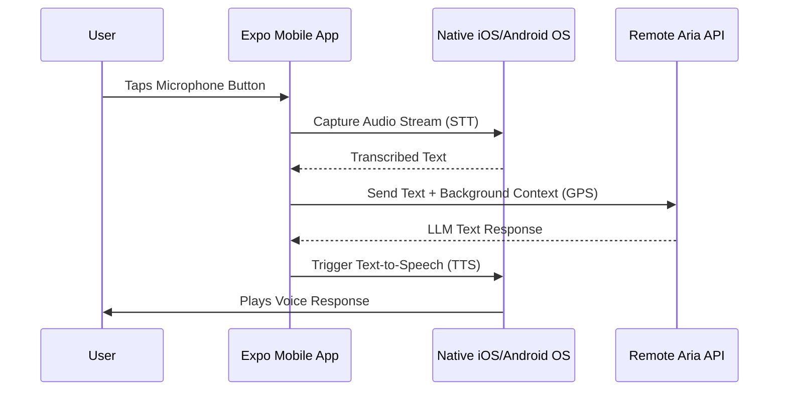

# Aria OS - Mobile Client 📱

This is the mobile client for **Aria OS**, built using **React Native** and **Expo**. It is designed to deploy natively to both **iOS** and **Android**.

## ⚙️ Application Workflow



The mobile client focuses heavily on **Voice-First interaction** and **On-the-Go Context**.

1. **Voice Input (STT):** The user triggers Aria via a mobile UI button. The app utilizes native device microphones (via Expo AV or native modules) to capture audio.
2. **Remote API Communication:** Since mobile devices cannot easily run the massive 4GB+ Llama 3 models or heavy Vector databases natively, this client acts as a thin shell. It sends the audio/text over the network to the central **Aria API** (FastAPI) running on your home server or cloud instance.
3. **Location & Context:** The mobile app can securely pass background context (like GPS coordinates) to the API, allowing the LangChain Agent to execute location-aware tools (e.g., "What is the weather *here*?").
4. **Response Delivery:** The API returns the AI's response, which the mobile app renders visually in a chat interface or plays back using native TTS (Text-to-Speech) modules.

## 🚀 Getting Started

### Prerequisites
- Node.js installed.
- Expo CLI (`npm install -g expo-cli`).
- Expo Go app installed on your physical iOS/Android device (or an Xcode/Android Studio emulator running).

### Installation

```bash
# Navigate to the mobile app directory
cd apps/mobile

# Install dependencies
npm install
```

### Running the App

```bash
npx expo start
```
This will start the Metro bundler. Scan the QR code using your physical phone's camera (iOS) or the Expo Go app (Android) to load the UI natively onto your device.

## 🔒 Privacy
Even though this is a mobile app communicating over a network, if you point the API URL to your local home IP address (e.g., `192.168.x.x`), all data remains strictly within your own private Wi-Fi network. No data goes to the public internet!
