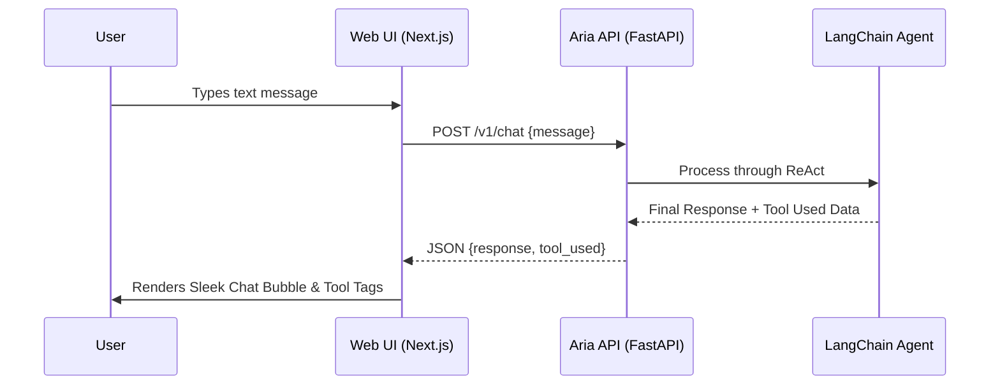

# Aria OS - Web Client 🌐

This is the primary web-based interface for **Aria OS**, built using **Next.js 14** (App Router) and **Tailwind CSS**. It provides a sleek, responsive, and dark-mode-first Chat UI for interacting with the Aria Core AI.

## ⚙️ Application Workflow



The Web Client is designed to be a lightweight presentation layer. It does not run any heavy AI models itself. 

1. **User Input:** The user types a message into the polished UI.
2. **API Request:** The Next.js client sends a `POST` request containing the text to the central FastAPI orchestrator (`apps/api/v1/chat`).
3. **Streaming/Response:** The backend orchestrator's LangChain Agent processes the request, executes any necessary tools (like Vector DB lookups), and returns the final formulated response along with a flag indicating which tools were utilized.
4. **UI Update:** The React component maps the response into a sleek chat bubble, rendering tool-usage tags to provide transparency into how Aria arrived at her conclusion.

## 🚀 Getting Started

### Prerequisites
Make sure the **Aria API** (FastAPI) is running locally on port 8000, either via Docker or natively.

### Installation

```bash
# Navigate to the web app directory
cd apps/web

# Install dependencies
npm install
```

### Running the Development Server

```bash
npm run dev
```

Open [http://localhost:3000](http://localhost:3000) with your browser to see the result.

## 🐳 Docker Deployment
This web application is bundled into a highly optimized, multi-stage Docker container (see `Dockerfile`). When deployed via the root `docker-compose.yml`, it serves static assets and Server Components natively without requiring a local Node environment.
